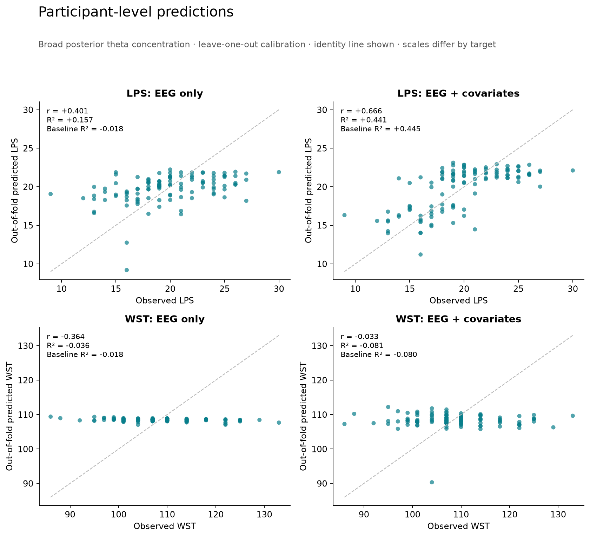
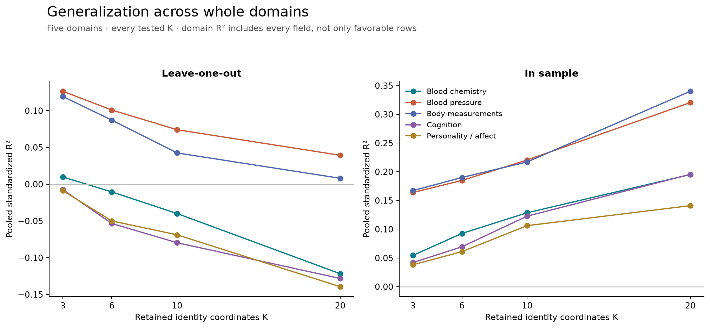
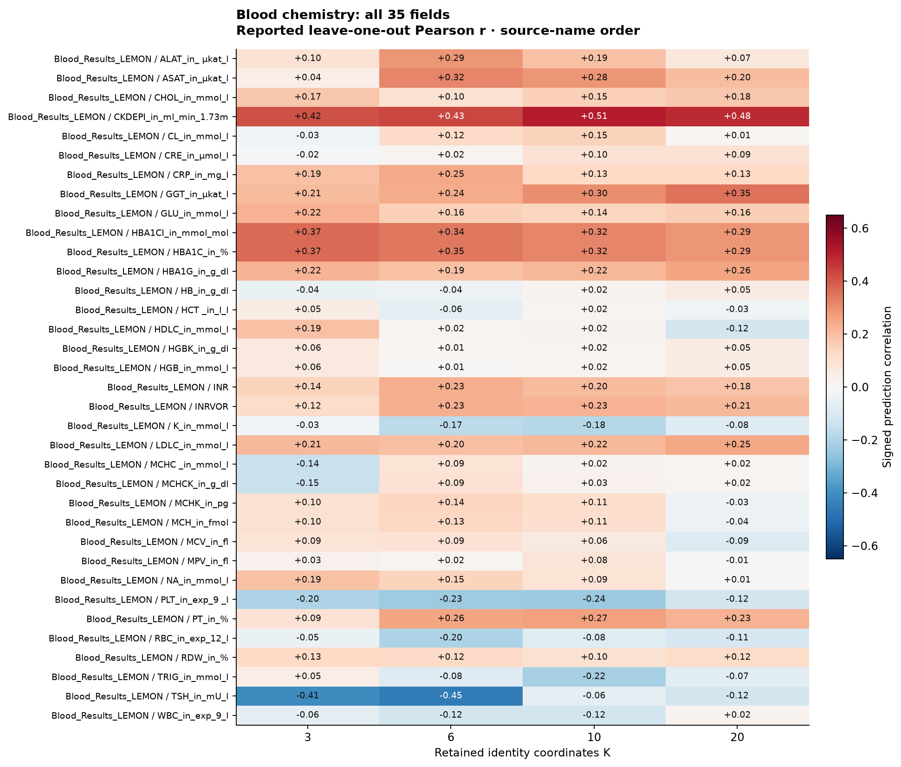
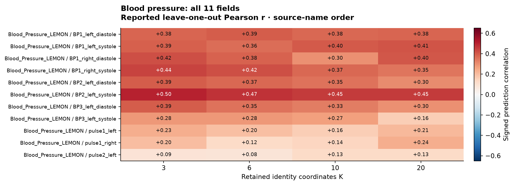
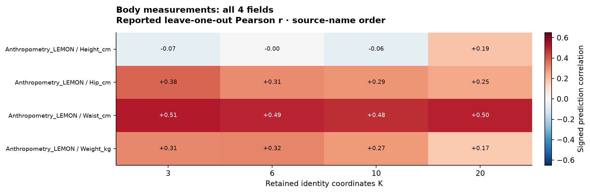

# Flint figure gallery

Eleven new figures accompany the original concentration figure. Each is available as PNG and SVG. The graphs distinguish the retained phenotype sweep from newly computed cross-validation of the scalar EEG readouts.

## New cross-validation

### Contribution beyond matched baselines


Points show leave-one-out ΔR². Horizontal segments show 5th–95th percentiles across 20 five-fold partitions; these are partition ranges, not confidence intervals. Each model is compared with its own training-fitted baseline. [SVG](figures/cv_incremental_performance.svg) · [Methods and full results](CROSS_VALIDATION.md).

### Held-participant predictions



All 111 participants, broad theta concentration readout. Scores and covariates are calibrated only in training folds. The model including covariates must be assessed against its covariate-only baseline. [SVG](figures/cv_predictions.svg).

### Stability across partitions


Every whole-cohort five-fold run is shown. Black segments mark median matched-baseline R². [SVG](figures/cv_partition_stability.svg).

## Retained phenotype cross-validation

These figures visualize original aggregate predictions from the five-band identity-coordinate experiment. They do not constitute newly refitted phenotype predictions. The original mean-imputed target convention and unadjusted prediction metric are documented in the [atlas](PHENOTYPE_ATLAS.md).

### All fields at a common coordinate count


All 291 fields at K = 6, including zero and negative results. Marks show domain medians, not significance. [SVG](figures/phenotype_distribution.svg).

### Whole-domain generalization



Pooled standardized R² for every domain at every tested K. [SVG](figures/domain_generalization.svg).

### Dimensionality curves


Six examples already highlighted in the previous release, each shown at all four K settings with both in-sample and leave-one-out performance. [SVG](figures/phenotype_dimension_curves.svg).

## Complete domain heatmaps

Each matrix includes every field at K = 3, 6, 10, and 20 in source-name order. All five plots use the same signed color scale. The larger cognitive and personality matrices are best opened as SVG for zooming. No label is selected or omitted by performance.

### Blood chemistry · 35 fields



[Full-size SVG](figures/atlas_blood_chemistry.svg).

### Blood pressure and pulse · 11 fields



[Full-size SVG](figures/atlas_blood_pressure.svg).

### Body measurements · 4 fields



[Full-size SVG](figures/atlas_body_size.svg).

### Cognition · 101 fields

[PNG](figures/atlas_cognition.png) · [Full-size SVG](figures/atlas_cognition.svg).

### Personality and affect · 140 fields

[PNG](figures/atlas_personality_affect.png) · [Full-size SVG](figures/atlas_personality_affect.svg).

## Original adjusted-association figure


This figure plots residual ranks from the original partial Spearman analysis. Its coefficients differ in meaning from the new out-of-fold prediction metrics. [SVG](figures/correlate.svg).

## Rebuild

```sh
python scripts/cross_validate_readouts.py
python scripts/plot_results.py
```

The [figure manifest](figures/figure_manifest.json) lists every generated figure and its source.
