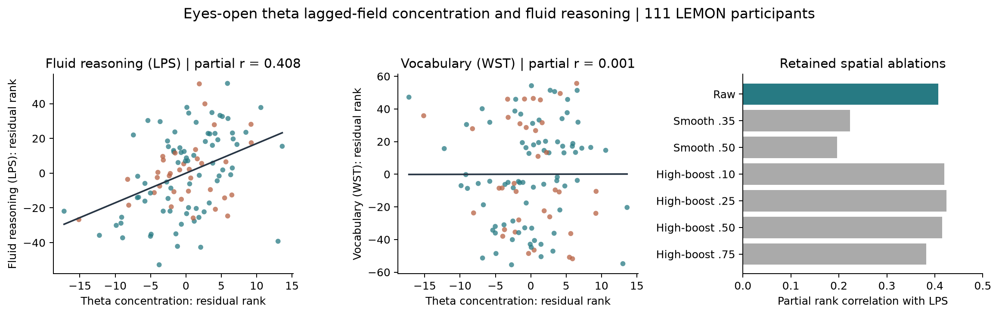
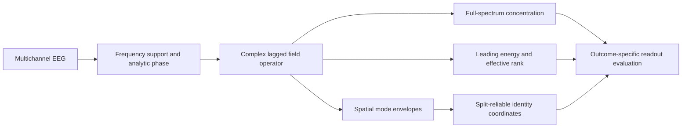
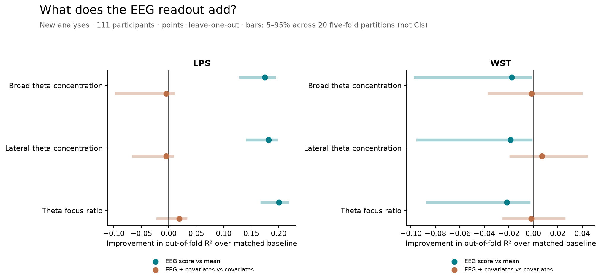
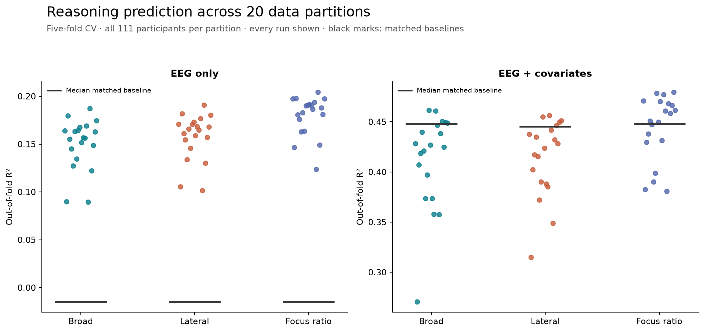
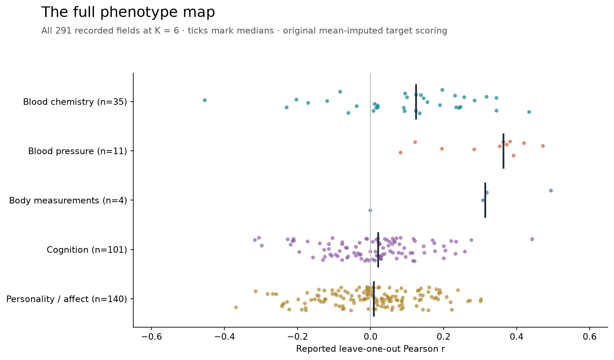
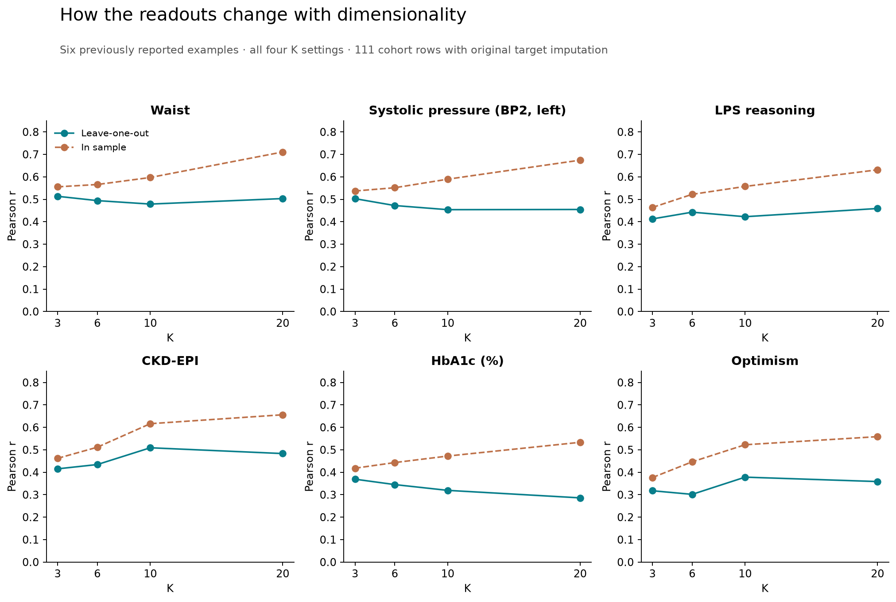

# Flint

**A general method for extracting structure from EEG.**

**[Simon Velez](https://github.com/zw5)**

Flint turns multichannel EEG into lagged field operators and derives distinct readouts of their temporal and spatial organization. The same method family supports spectral concentration, predictive focus, and repeatable spatial identity coordinates. This release applies those readouts to reasoning, vocabulary, and a 291-field map of physiology and behavior in LEMON.

[**Method and research note**](paper.md) · [**Cross-validation**](CROSS_VALIDATION.md) · [**Figure gallery**](FIGURES.md) · [**Complete phenotype atlas**](PHENOTYPE_ATLAS.md)

In **111 participants**, eyes-open posterior theta concentration correlates with fluid reasoning at **partial Spearman r = 0.408** after adjustment for age cohort, age-bin midpoint, theta power, and static phase locking. The association remains **r = 0.408** when vocabulary is included as an additional control.



| Measure | Result |
|---|---:|
| Fluid reasoning · LPS | **r = 0.408**, p = 1.31 × 10⁻⁵ |
| Vocabulary · WST | r = 0.001 |
| Participant-bootstrap 95% interval for the LPS association | [0.186, 0.549] |
| Within-recording consistency · odd/even windows | r = 0.954 |
| Participants | 76 younger adults · 35 older adults |

Correlations with LPS and WST use the same four controls. The bootstrap interval is conditional on the historically selected score. Within-recording consistency describes repeated measurements from one recording.

[**Read the research note →**](paper.md) · [**Explore all 291 phenotype fields →**](PHENOTYPE_ATLAS.md)

## Repository layout

| Path | What it holds |
|---|---|
| `paper.md` | The research note: method, configurations, results, and interpretation. |
| `CROSS_VALIDATION.md`, `PHENOTYPE_ATLAS.md`, `FIGURES.md` | Generated reports. Regenerate with the scripts below rather than editing by hand. |
| `PROVENANCE.md` | What was copied, what was recomputed, and what raw-data records are missing. |
| `scripts/` | Runnable Python that recomputes statistics, cross-validation, reports, and figures from the retained tables. Indexed in `scripts/README.md`. |
| `results/` | Participant features, evaluation tables, cross-validation outputs, and verification receipts. Described in `results/README.md`. |
| `figures/` | Every figure as PNG and SVG, plus a manifest of which script produced it. |
| `source_original/` | The original EEG-extraction and analysis source, archived unchanged. Not runnable here. Indexed in `source_original/README.md`. |
| `tests/` | Regression tests that re-derive the published cross-validation tables byte for byte. |

The runnable part of the release starts from retained per-participant tables. The step from raw EEG to those tables is documented in `paper.md` and archived in `source_original/`, but the exported EEG it depends on is not distributed. See [Provenance](PROVENANCE.md).

## How the general method works

Flint begins with a time-by-channel EEG field, a frequency support, and temporal lags. Filtering and the analytic signal provide a complex phase field. A lagged cross-field operator then records how the sensor coordinates at one time relate to those at a later time. Its complex entries and singular structure are the common starting point for several readouts.



| Readout | What it extracts | Example in this release |
|---|---|---|
| Spectral concentration | How singular-value energy concentrates across the complete spectrum | Posterior theta and fluid reasoning |
| Predictive focus | Leading energy fraction relative to entropy effective rank | Fixed-lag theta focus benchmark |
| Spatial identity | Repeatable spatial envelopes across windows and frequency bands | Five-band phenotype mapping |

The theta analysis uses 4–8 Hz and quarter-, third-, and half-cycle offsets of the measured carrier. The broader identity analysis uses five bands and split reliability. These are concrete configurations of the method, with different readouts; the spatial envelope is a reduced representation and should not be confused with the complete complex operator.

Extraction and outcome calibration are separate stages. The EEG operator and per-participant readouts are computed without fitting cognitive or blood labels. Mappings to an outcome use training participants, and their predictions are evaluated on held participants. The release includes source for the EEG extraction lineage and runnable commands for analysis of the retained features; a portable end-to-end raw-EEG package is not yet included.

## New cross-validated results

The new evaluation runs three fixed EEG scores on **111 participants**, using leave-one-participant-out and **20 repeats of five-fold cross-validation**. Predictor scaling and calibration use training participants only. All 27,972 held-participant predictions and exact fold assignments are published.

| EEG-only reasoning readout | Leave-one-out Pearson r | Out-of-fold R² |
|---|---:|---:|
| Broad posterior theta concentration | **0.401** | **0.157** |
| Lateral posterior theta concentration | **0.408** | **0.163** |
| Posterior theta focus ratio | **0.429** | **0.182** |

These are new predictive-calibration results on the retained EEG scores, distinct from the original adjusted partial Spearman association above. Their features were discovered historically in the same cohort.



The graph also tests what each EEG score adds to cohort, age-bin midpoint, power, and phase locking. For reasoning, broad and lateral concentration add approximately -0.004 and -0.005 to leave-one-out R²; the focus ratio adds +0.019. The full models' higher total correlations are largely supported by the covariate baseline. Vocabulary prediction has negative R² across all leave-one-out configurations. Every result is included in the [cross-validation report](CROSS_VALIDATION.md).



Each point is a complete five-fold run over the same 111 participants. The spread describes partition sensitivity, not additional participants or an external replication.

## Why this matters

Flint makes a concrete connection between **the organization of resting brain activity and the ability to reason through unfamiliar problems**. The main score has a physical and mathematical definition: the concentration of a measured lagged EEG operator. That makes the result inspectable. We can ask which frequencies, temporal offsets, and spatial relationships carry the association, and compare what survives when those coordinates change.

The broader research program reaches into physiology as well. A related Beam readout carries an association with **HbA1c**, a blood measure reflecting longer-term glucose exposure. That widens the question from a single cognitive score to the relationship between neural dynamics and the physiological state of the person producing them.

The significance is the prospect of a common measurement framework: derive structured readouts from the same family of lagged operators, then ask how their different coordinates relate to reasoning, metabolism, and other bodily measurements. If those relationships generalize, this could give research a way to study cognitive performance together with its physiological context. The current results supply concrete examples and reusable calculations with which to pursue that possibility.

## The wider map: body, cognition, and reported experience




The retained domain experiment examines **291 phenotype fields** across **five domains**, using four coordinate counts for **1,164 label-level results**. It asks how much of the measured person can be recovered from repeatable spatial structure in the EEG. The input coordinates come from the same five-band identity representation; each domain has its own cross-covariance map.

Here is a cross-section at **K = 6**, using one coordinate count throughout this table:

| Recorded field | Observed labels | Reported leave-one-out Pearson r |
|---|---:|---:|
| Waist circumference | 110 | **+0.494** |
| Systolic blood pressure · BP2, left | 109 | **+0.472** |
| Fluid reasoning · LPS_1 | 111 | **+0.443** |
| CKD-EPI laboratory field | 90 | **+0.434** |
| HbA1c · percentage | 109 | **+0.345** |
| Weight | 110 | +0.319 |
| ASAT laboratory field | 108 | +0.318 |
| Hip circumference | 110 | +0.308 |
| UPPS lack of perseverance | 111 | +0.303 |
| LOT-R optimism | 111 | +0.302 |
| ALAT laboratory field | 108 | +0.285 |
| Trail Making Test · TMT_1 | 111 | +0.276 |
| CRP laboratory field | 87 | +0.246 |

These examples are selected to show the range of measured fields. The [complete atlas](PHENOTYPE_ATLAS.md) includes every positive, near-zero, and negative result at K = 3, 6, 10, and 20, alongside the domain-level performance. It includes 35 blood-chemistry fields, 11 blood-pressure/pulse fields, four body measurements, 101 cognitive fields, and 140 personality/affect fields. Some are repeated measurements or alternate assay units; some are individual test or questionnaire items.

The breadth is what makes this research compelling: **a scalp electrical recording can carry statistical information about outcomes measured through a reasoning task, a tape measure, a blood-pressure cuff, a blood sample, and a questionnaire.** A repeatable mapping between those observations would provide a powerful way to study how cognition and physiology fit together within one person. Flint makes that idea concrete through explicit EEG operators and published result tables.

The map is uneven. At K = 6, pooled domain-level R² is positive for blood pressure (+0.101) and body size (+0.087), while blood chemistry (-0.011), cognition (-0.054), and personality/affect (-0.050) have negative pooled R² despite individual positive rows. A negative prediction correlation, such as the TSH row, is retained as a prediction failure rather than flipped into a success. **291 fields were examined; this is not a claim of 291 validated biomarkers.**

The broader table reports pooled prediction correlations with the original mean-imputation convention. It has no per-label significance correction and does not use the nuisance-adjusted primary analysis. The atlas and paper describe those details so the numbers can be interpreted and reproduced on their actual terms.

## Why HbA1c enters the picture




HbA1c measures glucose attached to hemoglobin and reflects average blood glucose over roughly three months. It therefore brings a much longer timescale into the analysis than an individual EEG oscillation. [NIDDK: The A1C Test & Diabetes](https://www.niddk.nih.gov/health-information/diagnostic-tests/a1c-test).

A short observation of a dynamic system can contain information about persistent conditions that shape its behavior. Applied here, the hypothesis is that aspects of metabolic and vascular physiology help shape repeatable patterns of neural coordination. HbA1c and EEG could then carry related information because they are measurements of an interconnected organism. This is an interpretation of the association, not a mechanism identified by this experiment. Earlier clinical work has reported changes in EEG activity and connectivity alongside intensified glycemic control, providing biological context for investigating such a relationship. [Cooray et al., 2011](https://pubmed.ncbi.nlm.nih.gov/20656408/).

The HbA1c experiment uses **broader spatial identity coordinates from five EEG bands**, rather than the single theta concentration score above. It derives coordinates that agree between odd and even recording windows, then fits a cross-covariance map to blood-chemistry measurements using the other participants in each leave-one-out fold.

| Identity coordinates retained | Reported HbA1c correlation across leave-one-out predictions |
|---|---:|
| 3 | **0.369** |
| 6 | 0.345 |
| 10 | 0.319 |
| 20 | 0.286 |

These are the original reported Pearson correlations. There are **109 observed HbA1c labels in a 111-participant analysis**; the original scoring includes mean-imputed missing targets. This analysis does not apply the age, power, and phase-locking controls used for Flint's primary reasoning result. The full [HbA1c evidence and domain tables](results/context/phenotypes/) are included, and the [research note](paper.md#physiological-extension-hba1c) explains the procedure and interpretation.

Across the tested settings, adding coordinates raises the in-sample fit while reducing the held-out correlation. That makes the compact readout particularly interesting: the result is already present in a few repeatable EEG coordinates. It motivates a hypothesis about shared physiological structure, while leaving the causal explanation and independence from age or other common factors to be tested. The percentage and mmol/mol HbA1c columns are two reports of the same assay, not separate replications.

**The opportunity is to connect fast neural dynamics with persistent cognitive and physiological differences through explicit, testable operators.** Establishing that connection across cohorts and over time would be a substantial advance. This release reports the existing association; it does not provide a calibrated blood test or continuous glucose measurement.

## Reproduce the statistics

Requires Python 3.11 or newer and the three packages in `requirements.txt`.

```sh
python3.11 -m venv .venv
.venv/bin/python -m pip install -r requirements.txt
.venv/bin/python -m unittest discover -s tests   # regression tests
.venv/bin/python scripts/verify.py                # recompute associations and bootstrap
.venv/bin/python scripts/cross_validate_readouts.py
.venv/bin/python scripts/write_cv_report.py       # CROSS_VALIDATION.md
.venv/bin/python scripts/build_phenotype_catalog.py  # PHENOTYPE_ATLAS.md
.venv/bin/python scripts/plot_results.py          # figures/
```

The same steps are available as `make test`, `make verify`, `make cv`, `make report`, `make atlas`, and `make figures`; `make all` runs every stage in order. Each script is deterministic, so a full rerun should leave the working tree unchanged.

For the fluid-reasoning experiments, the verifier recomputes **880 association rows**, including their within-table multiple-comparison corrections, and checks **28 reliability rows**. All **7,808 compared association values match the retained results exactly**. It also regenerates the figure and the participant-bootstrap interval.

| Material | Contents |
|---|---|
| [Research note](paper.md) | General operator method, configurations, and interpretation |
| [Cross-validation report](CROSS_VALIDATION.md) | New leave-one-out and repeated five-fold results |
| [Figure gallery](FIGURES.md) | Eleven additional PNG/SVG figures, including full domain heatmaps |
| [Participant features and results](results/retained/) | Complete tables for the two included experiments |
| [Verification](results/verification/verification.json) | Numerical agreement and bootstrap results |
| [Estimator source](source_original/) | Original implementation and supporting source files |
| [Phenotype atlas](PHENOTYPE_ATLAS.md) | Every reported field at every tested coordinate count |
| [Physiological and behavioral results](results/context/phenotypes/) | Original domain tables, HbA1c detail, and catalog coverage |
| [Provenance](PROVENANCE.md) | Input history, reproduction scope, and missing raw-data records |

This release reproduces the statistics from retained participant features. The original EEG export must be recovered to repeat EEG-to-feature extraction; the archived estimator files preserve their historical paths and imports. The broader phenotype extension contains retained summary results and source, with a separate evidence record; its participant predictions were not available for fresh recomputation.

## What the result establishes

Theta lagged-field concentration is associated with measured fluid reasoning in this LEMON cohort after the specified adjustments. The near-zero vocabulary association provides a useful comparison, although a formal difference between the two associations was not tested.

This is an exploratory result from a research program that examined several representations. Within-cohort splits measure stability; independent-cohort validation remains open. The q-values correct the named result tables, and the bootstrap interval conditions on the chosen score. The research note includes the null-normalized variants that did not retain the primary association.

## Dataset and citation

The human data were collected by **Babayan and colleagues** for the Leipzig Mind-Brain-Body dataset (LEMON). LPS-2 subtest 3 measures fluid reasoning; WST measures vocabulary and crystallized intelligence.

Babayan A, et al. *A mind-brain-body dataset of MRI, EEG, cognition, emotion, and peripheral physiology in young and old adults.* Scientific Data **6**, 180308 (2019). [doi:10.1038/sdata.2018.308](https://doi.org/10.1038/sdata.2018.308).

The [official LEMON page](https://fcon_1000.projects.nitrc.org/indi/retro/MPI_LEMON/MPI_LEMON.html) provides data access and a PDDL data-sharing link. EEG and behavioral files are also available through the [GWDG distribution](https://ftp.gwdg.de/pub/misc/MPI-Leipzig_Mind-Brain-Body-LEMON/). This repository distributes derived participant tables. Please cite the dataset descriptor alongside this work.
